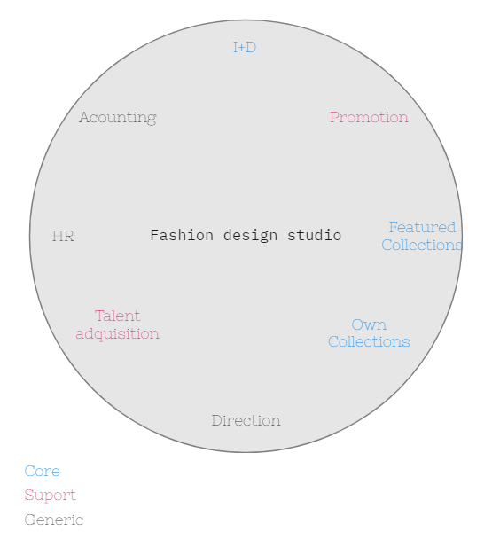
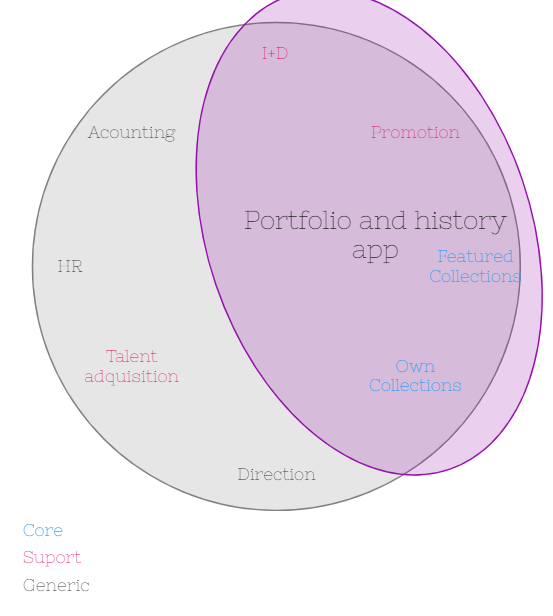
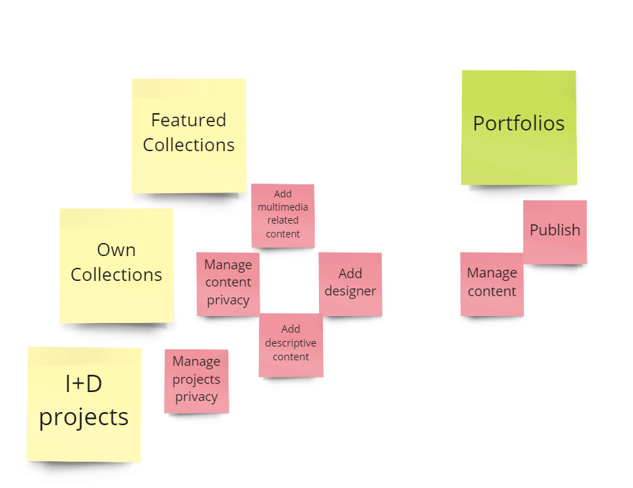
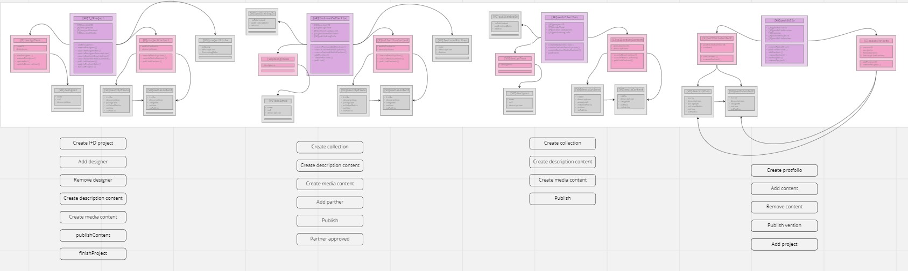
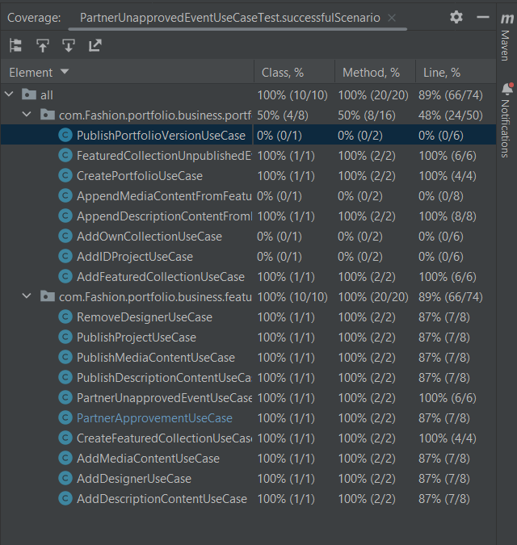

# SofkaU Training League - DDD Challenge.

## Description 
This repo contains the solution to a SofkaU DDD challenge.

The idea behind this project y to solve one of the possible needs a Fashion design studio could have.

The project was developed using Spring.

 

## Domain & Subdomains
The chosen Domain is a fashion design studio that offers two services, the design of featured collections and the design of their collections to sell using its brand. However, the main goal of the company is to be a reference to the world regarding the innovation and development of new design strategies and production methods.

To begin with the mapping of the improvement opportunities the bussines was divided into eigth subdomains as shown in the following image

The core subdomains are related to the two services offered by the studio and the main goal of the company, the two supports are, talent acquisition which refers to the seeking of new and talented designers that can help to offer better services and that bring new ideas to the company, and promotion that refers to the way the studio shows itself to the world; a mandatory activity to fulfill the main objective of recognition and to gather new and bigger clients.

The generic subdomains refer to other facets of the studio that we have to take into account when understanding the needs, but won't be relevant for this project.
 

## Bounded Context
Among all the possible solutions that can be offered to the studio, and based on the knowledge of design studios I have gathered from my college experiences, a solution to have control of the relevant content created in the projects the studio participates in is what comes to mind. the image below shows the domains involved in this bounded context.   

 

## Ubiquitous Language

To further define the context of the solution some of the Ubiquitous language is described in the following image, these concepts will be expanded in the next section.

 

## Domain Model

The developped solution will be containing 4 agregates:

<ul>
  <li>I_DProject</li>
This aggregate represents the projects the studio participates in, to fulfill its main goal.
This aggregate as the next two share 2 entities: DesignTeam which represents the people involved in the project and the ProjectContent that refers to the relevant content created during the project
  <li>featuredCollection</li>
This aggregate represents the projects the studio participates in when offering a service to third parties.
  <li>ownCollection</li>
This aggregate represents the projects the studio participates in when designing the collections that will be sold using its brand.
</ul>

the image is unreadable so this is the link to the MIRO board containing all the information <href>https://miro.com/app/board/uXjVPgLr7oY=/?share_link_id=951297468337</href>
 

## Command Driven Use Cases

In an atempt to cover all the functionalities in the solution many comand driven UseCases were contructed but only 11 were tested:

<ul>
  <li><h2>Featured Project</h2></li>
  <li>CreateFeaturedProjectUseCase: This UseCase recives a command with the information to create a new freatured collection</li>
  <li>AddDesignerUseCase: This UseCase adds the information from any designer to the collection</li>
  <li>AddDescriptionContentUseCase: This UseCase adds information from any description content to the project</li>
  <li>AddMediaContentUseCase: This UseCase adds information from any media content to the project</li>
  <li>PartnerApprovmentUseCase: This UseCase recives a command indicating the related partner approves the publication of the project in a portfolio</li>
  <li>PublishDescriptionContentUseCase: This UseCase change the state of a description content to published so it can be used in a portfolio</li>
  <li>PublishMediaContentUseCase: This UseCase change the state of a media content to published so it can be used in a portfolio</li>
  <li>PublishProjectUseCase: This UseCase change the state the project so its content can be used in a portfolio</li>
  <li><h2>Portfolio</h2></li>
  <li>CreatePortfolioUseCase: This UseCase recives a command with the information to create a new portfolio</li>
  <li>AddFeaturedCollectionUseCase: This UseCase includes a project in a portfolio</li>
  <li>AppendDescriptionContentUseCase: This UseCase appends a description content form a project to be published wen a protfolio version is released</li>
</ul>

 

## Event Driven Use Cases
This are the two requiered event driven UseCases:

<ul>
  <li><h2>Featured Project</h2></li>
  <li>PartnerUnapprovedEventUseCaseTest: This UseCase trigers wen a parter unapproves an allready aproved project, this project will get unapproved and unpublished</li>
  <li><h2>Portfolio</h2></li>
  <li>FeaturedCollectionUnpublishedEventUseCaseTest: This UseCase trigers a project has been unpublished, the unpublished project will bee removed from the portfolio </li>
</ul>

 

## Event Driven Use Cases
The next image shows the tests coverage, it isn't 100% because there are more UseCases than tests, but all test were performed using the debugger, and all implementations are working as intended

## Authors
By Isan Eduardo Franco Miranda.
